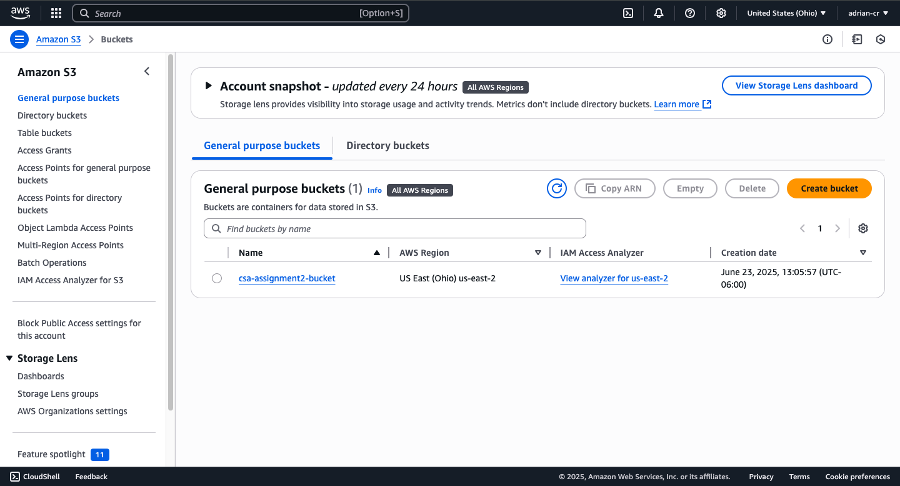
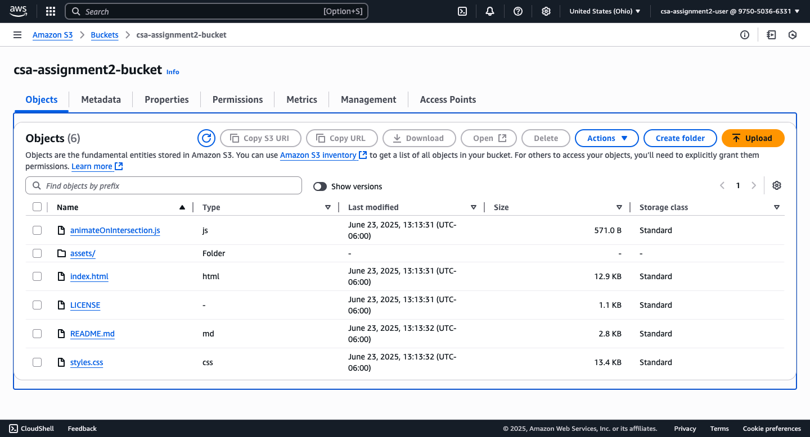
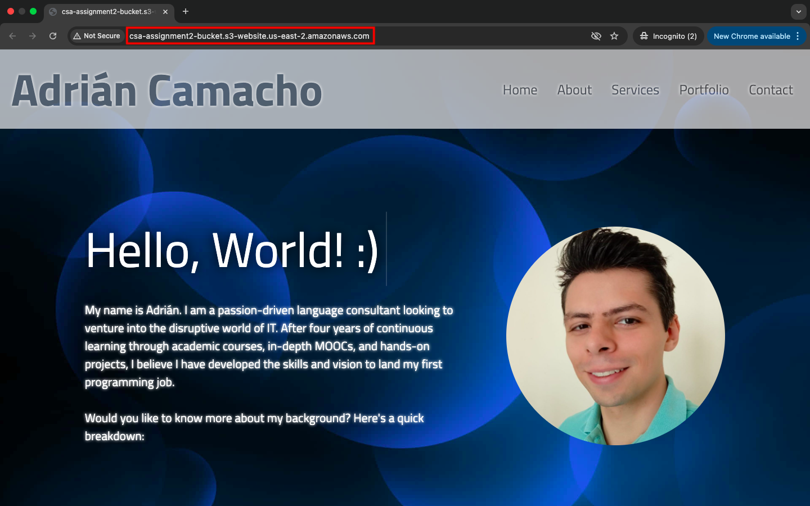
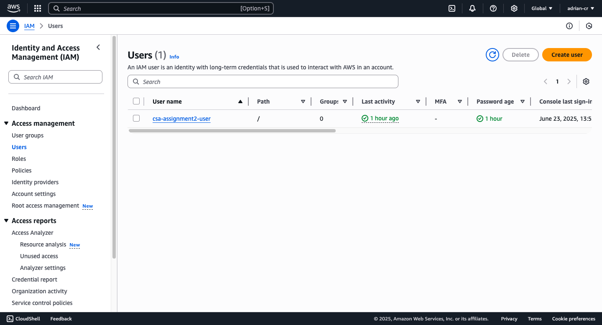
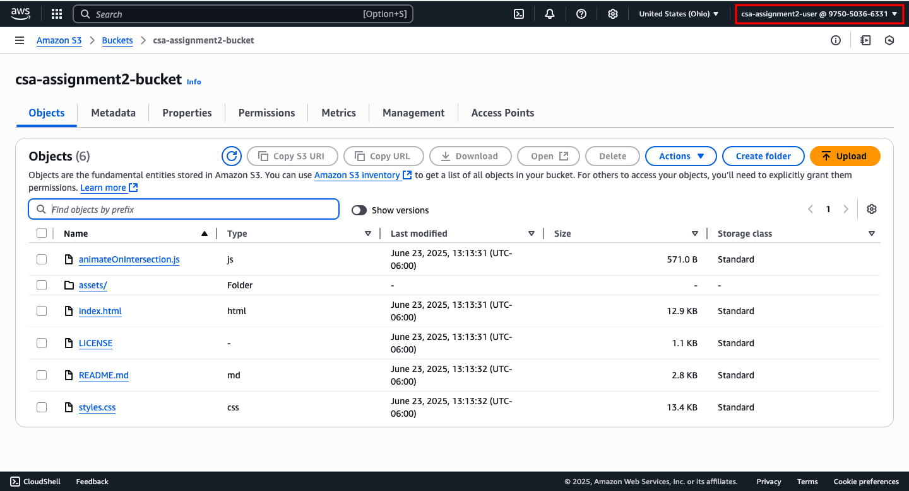
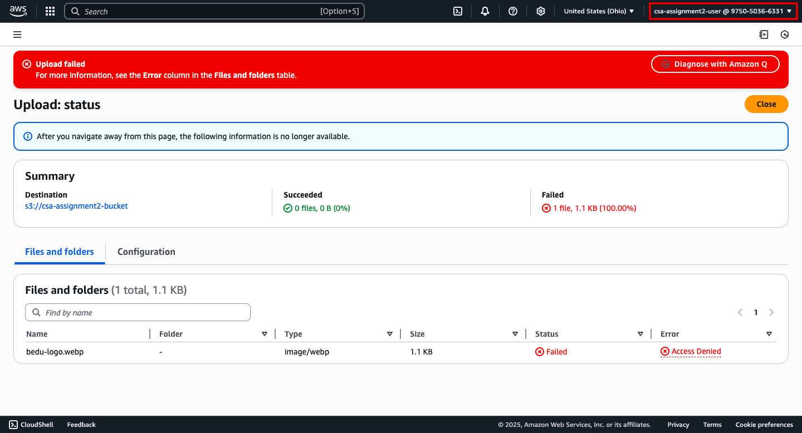
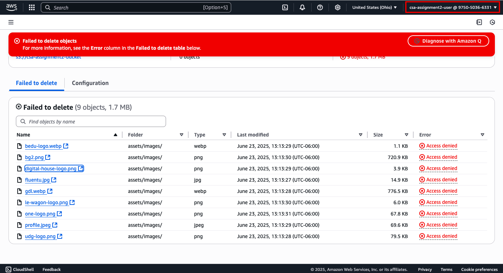
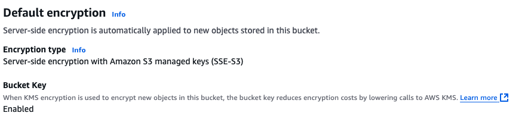

# Assignment S3-based Storage System
This assignment involved creating a simple S3-based storage system with the additional implementation of bucket policies and IAM roles.

Below are the steps taken to complete the assignment:

## 1. S3 Bucket Creation
I created an S3 bucket named `csa-assignment2-bucket ` using the AWS Management Console. The bucket was configured to allow public access for testing purposes:



## 2. File Upload
I uploaded the files for a previous front-end project ([see GitHub repository](https://github.com/adrian-cr/csa-capstone-multi-section-homepage)) to the S3 bucket:



## 3. Project Deployment
I set the project's `index.html` file as the bucket's entry point, making the project load when accessing the bucket's [public URL](http://csa-assignment2-bucket.s3-website.us-east-2.amazonaws.com/):




## 4. Bucket Policy Configuration

Since all the files were public, I set the bucket policy to allow public access to all objects in the bucket:

```json
{
  "Version": "2012-10-17",
  "Statement": [
    {
      "Sid": "PublicReadGetObject",
      "Effect": "Allow",
      "Principal": "*",
      "Action": "s3:GetObject",
      "Resource": "arn:aws:s3:::csa-assignment2-bucket/*"
    }
  ]
}
```

## 5. IAM Policy Implementation
I also created a test user named `csa-assignment2-user` with restricted permissions to ensure that the bucket policy was working correctly:



The user was able to access the project's bucket and its enclosing files:



But it was not able to modify the bucket policy, upload, or delete any files:





## 6. Security
I ensured that the files in the bucket were secure by ensuring the use server-side encryption with Amazon S3-managed keys (SSE-S3):


